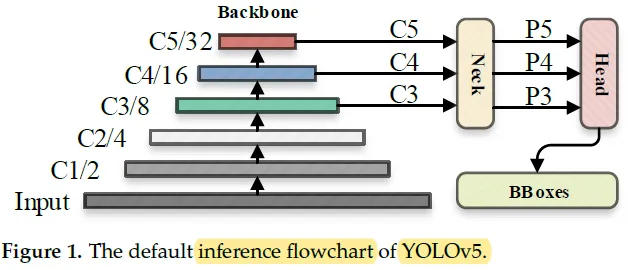
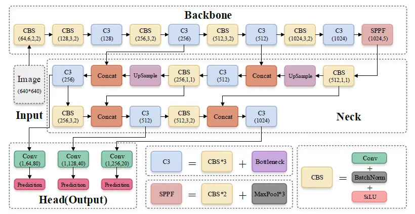
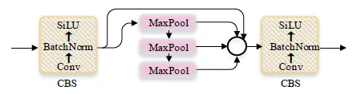
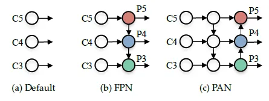
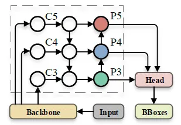
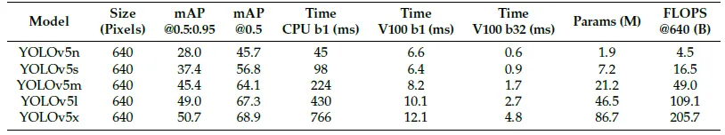

**YOLOv5: Overview in Hinglish**

1. **YOLOv5: Overall Architecture (Overall Structure)**  

YOLOv5 ek object detection model hai, jisme sabse pehle image ko input layer se process kiya jaata hai, fir backbone ko bheja jaata hai feature extraction ke liye.  
Backbone image se different size ke feature maps banata hai. Ye feature maps fir neck (feature fusion network) me jate hain, jahan pe unhe merge kiya jaata hai. Result me teen feature maps milte hain: P3, P4, aur P5. In maps ka size 80x80, 40x40, aur 20x20 hota hai, jo chhote, medium aur bade objects ko detect karne ke liye use kiye jaate hain.  
Fir in feature maps ko head (prediction layer) me bheja jaata hai, jahan object ki class, confidence, bounding box ka coordinate, width aur height calculate hote hain.  
Aakhir mein, unwanted information ko filter karne ke liye threshold values set ki jaati hain aur non-maximum suppression (NMS) ke through final detection output milta hai.

---

2. **YOLOv5: Backbone**  

Backbone kaam karta hai feature extraction ka, aur YOLOv5 ka backbone **CSPDarknet53** hai.  
Backbone mein **CBS (Convolution + BatchNorm + SiLU)** modules stacked hote hain aur **C3 modules** bhi hote hain, jo feature extraction me madad karte hain.  
Aur fir ek **SPPF (Spatial Pyramid Pooling Fast)** module hota hai jo backbone ke feature expression ko enhance karta hai. SPPF ka kaam hai ki pooling operation ko speed up karna, jisse processing fast hoti hai.

---

3. **YOLOv5: Neck**  

Neck ka kaam feature fusion ka hai, jisme **FPN (Feature Pyramid Networks)** aur **PAN (Path Aggregation Network)** ka use kiya jaata hai.  
FPN ka idea ye hai ki jo feature maps C3, C4, C5 (convolution layers se aane wale maps) se milte hain, unhe up-sample karke alag feature maps (P3, P4, P5) banaye jaate hain jo different size ke targets ko detect karne ke liye use hote hain.

---

4. **YOLOv5: Head**  

Head ka kaam hai bounding box regression. Ismein image ke feature map ke top-left corner ko (0,0) set kiya jaata hai.  
**rx** aur **ry** unadjusted coordinates hote hain predicted center point ke liye. Fir **gx, gy, gw, gh** se box ki final position aur size adjust kiye jaate hain.  
**sx** aur **sy** offsets represent karte hain jo model calculate karta hai, jisse final prediction box ka size aur location adjust hota hai.

---

5. **YOLOv5: Model Variants**  

YOLOv5 ke 5 different versions hain:  
- **YOLOv5x**  
- **YOLOv5l**  
- **YOLOv5m**  
- **YOLOv5s**  
- **YOLOv5n**  

Inke large versions bhi hain, jaise YOLOv5x6, YOLOv5l6, etc. Har ek version ka size aur speed different hota hai.  
**YOLOv5l** ka detailed architecture ulta links me diya gaya hai.

---

6. **Results**  
- **Larger Models (Bade Models):**  
  YOLOv5 ke larger models jaise **YOLOv5x6** MS COCO pe EfficientDet ko kaafi achha outperform karte hain.  
- **Smaller Models (Chhote Models):**  
  Smaller models jaise **YOLOv5n** bhi EfficientDet se fast hote hain aur performance bhi achha dete hain.

---

### **Simpler Definitions of ML and Computer Vision Terms:**

- **Machine Learning (ML):**  
  Ye ek technique hai jisme computers ko bina explicitly program kiye data se seekhne ki ability di jaati hai. Matlab, computer apne experience se decision banaata hai.

- **Object Detection:**  
  Ye ek task hai jisme model ko image ya video me objects identify karne hote hain. Jaise kisi image me logo, car, tree, etc. ko find karna.

- **Backbone:**  
  Ye ek part hota hai model ka jo image se features (important information) extract karta hai. Isko ek tarah se ek initial processing layer samajh sakte hain.

- **Feature Map:**  
  Ye image ka ek representation hai, jo model ke layer ke through pass hone ke baad banata hai. Har feature map image ki kuch specific details (jaise edges, colors, shapes) ko represent karta hai.

- **Bounding Box:**  
  Ye ek rectangle hota hai jo kisi object ko image me highlight karta hai. Iska use object detection me hota hai jahan object ka exact location aur size define karna hota hai.

- **Non-Maximum Suppression (NMS):**  
  Ye ek technique hai jo duplicate predictions ko remove karti hai, taaki final prediction me sirf best bounding box dikhe.

---

### **Detailed Explanation for YOLOv5 (Small) Version in Hinglish**  

**Introduction**  
YOLOv5 ke 4 versions hain, aur is article mein hum specifically **YOLOv5-s (small)** version ke baare mein baat karenge. Baaki versions mein koi major changes nahi hain, bas unka architecture aur parameters ka size thoda alag hota hai.  

Ye article YOLOv5 ke pehle release par based hai, aur future updates ke saath kuch changes ho sakte hain, toh main future versions ke liye bhi updates dene ki koshish karunga.

---

### **Important Topics Covered in the Article**  
- YOLOv5 Model Architecture
- Activation Function
- Optimization Function
- Cost Function (Loss Function)
- Weights, Biases, Parameters, Gradients, and Final Model Summary

---

### **YOLOv5 Model Architecture**  
**YOLOv5** ek **single-stage object detection** model hai. **Single-stage** ka matlab hai ki yeh model ek hi step mein input image ko process kar ke output dete hai, bina kisi intermediate step ke. Is architecture ke 3 main parts hain:

1. **Model Backbone**  
2. **Model Neck**  
3. **Model Head**  

#### 1. **Model Backbone**  
Backbone ka kaam hai image se **features** (important information) extract karna. Jaise aap image ko dekht ho aur usme se kuch objects ko identify karte ho (jaise "car" ya "person"), waise hi model backbone ko use karta hai to extract features jo objects ko samajhne mein madad karte hain. YOLOv5 mein **CSPNet** (Cross Stage Partial Networks) backbone ke roop mein use hota hai, jo deep networks ke saath image processing ko kaafi fast banata hai.

#### 2. **Model Neck**  
Neck ka kaam hai **feature pyramids** banana. Feature pyramids ka matlab hai ek structure jisme model ko alag-alag sizes aur scales pe objects ko detect karne ki ability milti hai. Matlab agar koi object chhota ya bada ho, model phir bhi usse detect kar sake.  
YOLOv5 mein **PANet (Path Aggregation Network)** ka use hota hai neck ke liye. Yeh feature pyramids banata hai jisse model ko multiple scales pe kaam karne ki ability milti hai.

#### 3. **Model Head**  
Model head ka kaam hai **final detection** karna. Yeh anchor boxes ko apply karta hai aur final output generate karta hai jisme class probabilities, objectness score (kitna confident hai model ki object exist karta hai) aur bounding box ki coordinates hoti hain.

---

### **Activation Function**  

**Activation Function** ek function hai jo neural networks mein use hota hai, aur yeh decide karta hai ki ek neuron (neural network ke unit) ko **active** ya **inactive** hona chahiye. Yeh function **decision making** ka kaam karta hai.

Agar aap kisi neuron ko "activate" karte ho, toh uska output next neuron ko send hota hai. Agar aap "inactive" rakhte ho, toh output kisi aur neuron ko send nahi hota.

### **Detailed Explanation of Activation Functions:**

1. **Leaky ReLU:**  
   Leaky ReLU ek activation function hai jo neural network ki **hidden layers** mein use hota hai. Leaky ReLU mein agar input value negative hoti hai, toh yeh thodi bahut value ko pass karne deta hai, isliye isse **"leaky"** kaha jata hai. Yeh model ko **negative values ko ignore na karne** mein madad karta hai, jisse network zyada efficient hota hai.

   - **Example**: Agar input value -10 hai, toh normally ReLU function usse zero bana dega, lekin Leaky ReLU usse thoda thoda negative value pass kar deta hai, jo network ko help karta hai better learn karne mein.

2. **Sigmoid:**  
   Sigmoid function ko YOLOv5 ke **final detection layer** mein use kiya jata hai. Iska kaam hai output ko **0 se 1 ke beech** compress karna. Yeh **probability** ko predict karta hai. Agar output 0.8 aata hai, toh iska matlab hai ki model ka confidence level 80% hai ki object us region mein hai.

   - **Example**: Agar Sigmoid ka output 0.9 hai, toh iska matlab hai ki model ko 90% surety hai ki object wahan hai.

---

### **Optimization Function**  
**Optimization function** ka kaam hota hai model ko train karte waqt **weights aur biases ko update karna**, jisse model achha kaam kare.  

- **SGD (Stochastic Gradient Descent)**: Yeh ek **basic optimization method** hai. SGD ka use karte hue, model har step pe **gradients** calculate karta hai aur weights ko update karta hai.
  
- **Adam**: Yeh ek advanced optimization method hai, jisme learning rate ko adjust karna thoda intelligent tareeke se hota hai. Adam generally **faster** aur **more efficient** hota hai, especially jab data complex ho.

---

### **Cost Function or Loss Function**  

**Loss function** ka kaam hota hai model ke performance ko **measure** karna. Matlab, agar model galat prediction karta hai, toh loss function us error ko calculate karta hai.

- **Compound Loss**: YOLOv5 mein ek combination of 3 losses calculate kiye jaate hain:
  - **Objectness score loss**: Yeh measure karta hai kitna confident model hai ki koi object wahan hai.
  - **Class probability loss**: Yeh measure karta hai ki model kitna accurate hai object ke class (jaise car, person, etc.) ko predict karne mein.
  - **Bounding box loss**: Yeh calculate karta hai ki model ka box prediction actual box se kitna match karta hai.

Ultralytics ne **Binary Cross-Entropy Loss** use kiya hai for class prediction aur objectness score. Agar aap **Focal Loss** use karna chahte hain (jo harder examples pe zyada focus karta hai), toh uska option bhi hai.

---

### **Weights, Biases, Parameters, Gradients, and Final Model Summary**  

- **Weights aur Biases**: **Weights** har input feature ko ek importance (weight) dete hain, aur **biases** model ki output ko adjust karte hain. Yeh dono training ke dauraan update hote hain.
  
- **Parameters**: Yeh wo values hain jo model ke andar stored hoti hain. Yeh training ke dauraan update hoti hain, aur model ka behaviour control karti hain.

- **Gradients**: **Gradients** calculate karte hain ki kitna change chahiye weights ko update karne ke liye. Gradient descent algorithm in gradients ka use karke weights ko adjust karta hai.

---

### **Summary**

1. **YOLOv5 Model Architecture**: 3 parts - Backbone (CSPNet), Neck (PANet), Head (final detection).
2. **Activation Functions**: Leaky ReLU (hidden layers) aur Sigmoid (final layer).
3. **Optimization Function**: SGD (default) ya Adam (advanced).
4. **Loss Function**: Compound loss including objectness, class probability, and bounding box loss.
5. **Model Parameters**: 191 layers, 7.468 million parameters.

---

### **Simplified Definitions of Key ML and CV Terms for a Newbie:**

- **Object Detection**: Ye task hai jisme model ko images ya videos mein **objects ko identify** karna hota hai. Jaise "Yeh car hai", "Yeh dog hai", etc.

- **Activation Function**: Ek function hai jo neural network ke **neurons ko activate** karta hai. Matlab, jab ek neuron ke input ka calculation hota hai, tab activation function decide karta hai ki output ko next neuron ko bhejna hai ya nahi.

- **Optimization Function**: Model ko **train karte waqt** **weights aur biases ko update karna** taaki model better prediction de sake. Jaise kisi ko **practice karna** pade to improve kare, waise hi model ko optimize karna hota hai.

- **Loss Function**: Ye measure karta hai **model ki prediction** kitni galat thi. Agar model ne galat answer diya, toh loss function us error ko calculate karta hai aur model ko better karne ki directions deta hai.

- **Parameters**: Model ke andar wo values jo training ke dauraan change hoti hain, jaise weights aur biases, jisse model ki working decide hoti hai.

- **Gradients**: Ye show karte hain ki **weights ko kitna adjust karna** hai taaki model ko improve kiya jaa sake. Gradient descent algorithm in gradients ko use karke model ko improve karta hai.

---

### **1. Object Detection:**

**Example:**  
Socho aapko ek image di gayi hai jisme **cheetah**, **fox**, **hyena**, **lion**, **tiger**, aur **wolf** sab ek sath dikh rahe hain. Ab aapka kaam hai un sab animals ko detect karna, aur unhe label karna ki yeh kaunsa animal hai.  

**Explanation:**  
Object detection ka matlab hai kisi image ya video mein **specific objects ko pehchanna**. Toh agar aapko ye animals detect karne hain, toh model ko train karna padta hai taaki woh image mein se har ek animal ko identify kar sake, jaise:
- "Yeh cheetah hai"
- "Yeh lion hai"
- "Yeh tiger hai"

Toh **object detection** mein aap image ke har part ko label karte ho, jisme object ka **name** aur **position** dono bataya jaata hai.

---

### **2. Activation Function:**

**Example:**  
Socho aapne **cheetah** ke image ka analysis kiya. Ab aapko decide karna hai ki **yeh cheetah hai** ya **kuch aur animal hai**. Yeh decision lene ke liye, aapko activation function ka use karna padega.

**Explanation:**  
Activation function ek **decision maker** hota hai. Jaise aap apne dimaag mein soch rahe ho ki "Yeh cheetah hai ya nahi?", waise hi model apne neurons ke beech mein **decision leta hai** ki kya image mein cheetah hai ya kuch aur.

- Agar input value positive hoti hai (jaise cheetah ko identify karna), toh model "activate" karta hai aur bolta hai "Yes, yeh cheetah hai!"
- Agar input value negative hoti hai (jaise **wolf** ko galat predict karna), toh model "inactive" ho jaata hai aur woh prediction ko discard kar deta hai.

Is tarah se **activation function** decide karta hai ki output next neuron ko send karna hai ya nahi.

---

### **3. Optimization Function:**

**Example:**  
Aapko ek model train karna hai jo images ko detect kare, jaise **lion** ko pehchane. Ab training ke dauraan agar model galat predict karta hai, toh **weights aur biases** ko adjust karne ki zarurat hoti hai.

**Explanation:**  
Optimization function ka kaam hota hai model ko train karte waqt **weights** ko update karna. Jaise agar model ne **lion** ko **wolf** ke jaise predict kiya, toh optimization function ke through model ko sahi direction mein guide kiya jaata hai.  

- **SGD (Stochastic Gradient Descent)** ya **Adam** optimizer use karte hain jo model ke errors ko dekhte hain aur weights ko adjust karte hain taaki model better predictions de sake.
- Toh yeh optimization functions training mein help karte hain taaki model ka performance improve ho.

---

### **4. Loss Function (Cost Function):**

**Example:**  
Maan lo model ne **cheetah** ko **fox** ke jaise predict kiya. Toh loss function ka kaam hota hai yeh calculate karna ki **model kitna galat tha**.

**Explanation:**  
Loss function model ki **mistakes** ko measure karta hai. Jaise agar model ne **cheetah** ko **fox** ka label diya, toh loss function model ko batayega ki **yeh mistake thi** aur kitna galat tha. 

Loss function kuch aise cheezein calculate karta hai:
- **Objectness score:** Model ka confidence level ki koi object wahan hai ya nahi.
- **Class probability:** Model ka confidence ki yeh **cheetah** hai ya koi aur animal (jaise **fox**).
- **Bounding box loss:** Box ka accuracy, jo model ke prediction ke liye size aur position determine karta hai.

---

### **5. Weights, Biases, Parameters, Gradients:**

**Example:**  
Socho aapko **lion** ko identify karna hai aur aapne model ko train kiya. Is training ke dauraan **weights**, **biases**, aur **parameters** ko update kiya jaata hai. 

**Explanation:**  
- **Weights**: Har feature (jaise image ke different parts) ka **importance** decide karte hain. Jaise cheetah ka face ya lion ka mane model ke liye important ho sakte hain, toh un parts ke weights zyada hote hain.
  
- **Biases**: Ye thoda adjustment karte hain output ko. Jaise agar model ko **lion** thoda confusion ho, toh bias usko thoda help karta hai better output dene mein.

- **Parameters**: Yeh wo values hain jo model ke andar hoti hain aur training ke dauraan update hoti hain. Jaise cheetah, fox, lion ke features ko samajhna.

- **Gradients**: Gradients ko samajhna thoda complex ho sakta hai, lekin simple tarike se agar aap **lion** ko **fox** se alag karna chahte hain, toh **gradients** calculate karte hain ki **kitna change** chahiye weights ko adjust karne ke liye.

---

### **In Short:**

1. **Object Detection** = Jaise aapko image mein cheetah, lion, aur fox ko identify karna ho.
2. **Activation Function** = Jaise aapka dimaag decide karta hai ki yeh cheetah hai ya nahi, waise hi model ka decision mechanism hota hai.
3. **Optimization Function** = Agar model ne galat predict kiya, toh optimizer help karta hai weights ko adjust karne mein.
4. **Loss Function** = Model ki mistakes ko calculate karta hai, jaise **cheetah ko fox** predict karna.
5. **Weights, Biases, Parameters, Gradients** = Yeh sab values hain jo model ko **train karte waqt adjust hoti hain**.

---

### **Example Recap with Terms**:

Aap ek image mein **cheetah**, **fox**, aur **lion** ko identify karna chahte ho. Agar model ne **lion** ko **wolf** predict kiya, toh **loss function** calculate karega ki model kitna galat tha. **Optimizer** usko sudharega, aur **weights** ko adjust karega taaki agle time model **correct prediction** kare. **Activation function** decide karega ki input image ko **active** karna hai ya nahi, aur **gradients** batayenge ki model ko **weights ko kitna change karna** hai.

---
